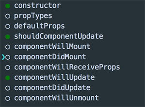

# react-native-generator

Why use this when there are other generators?

There are different type of generator to help create react and redux based application. They are doing great job with action, enums and reducers generation, but based on exist experience we believe that module based structuring is more reliable way to go. This generator created in mind to provide efficient way for  component, container, screens, actions, generator. You can create a  project (React Native) structure fro 20 minutes, **save your time** :) . It's very simple and convenient for using.

----------

# Install

    yarn  add -D rn-generator

**or**

    npm install -D rn-generator

Open package json and add generate command within the scripts option

    "scripts": {
	    "generate:run": "generate"
	}

# Generators

The generator help to generate following components.

- Component generator
	- Name: The  name of the component. i.e `(Button, LoginForm etc.)`
	- Flow: The static type
	- Use PureComponent / Component
	- Component properties: choose the component properties i.e `( constructor, propTypes, default props ) or life cycles ` 
	- 
	- Tests
- Container generator
	- Name: the name of the container, i.e. Awesome, which converts to: AwesomeContainer.
	- Component: you must select the component in list, that connects this container.
	- Module
	- Actions: set the action names
- Redux store configuration generator
	- Create store config file 	 

To run the generators with a list of options, run

    yarn run generate

**or**

    npm run generate

> **Note:**
>
>  When you use the generator you need to use  "redux-action", for actions and reducers. You can see it [there](https://www.npmjs.com/package/redux-action)

# Configs

The generators output paths can be configured in two ways.

 **1. package.json**

You just need create rnGenerator properties in package.json file and give relative paths

	"rnGenerator": {
	   "paths": {
	     "componentsDir": "src/components/"
	    }
	}
 
 
 **2. .rnGenerator**

Create ".rnGenerator" file in the root directory (where package.json is)

Set your custom configs there as json data

	{
		"paths": {
			"rootReducerPath": "src/reducers/index.js",
		    "componentsDir": "src/components",
		    "containersDir": "src/containers",
		    "modulesDir": "src/modules",
		    "testRootDir": "./__test__",
		    "rootFile": "src/index.js",
		    "storePath": "src/store",
		    "appFile": "src/app.js,
		    "templatePath": "",
		}
	}

# Roadmap

- [ ]  Add custom generators
 

# Licence
MIT
